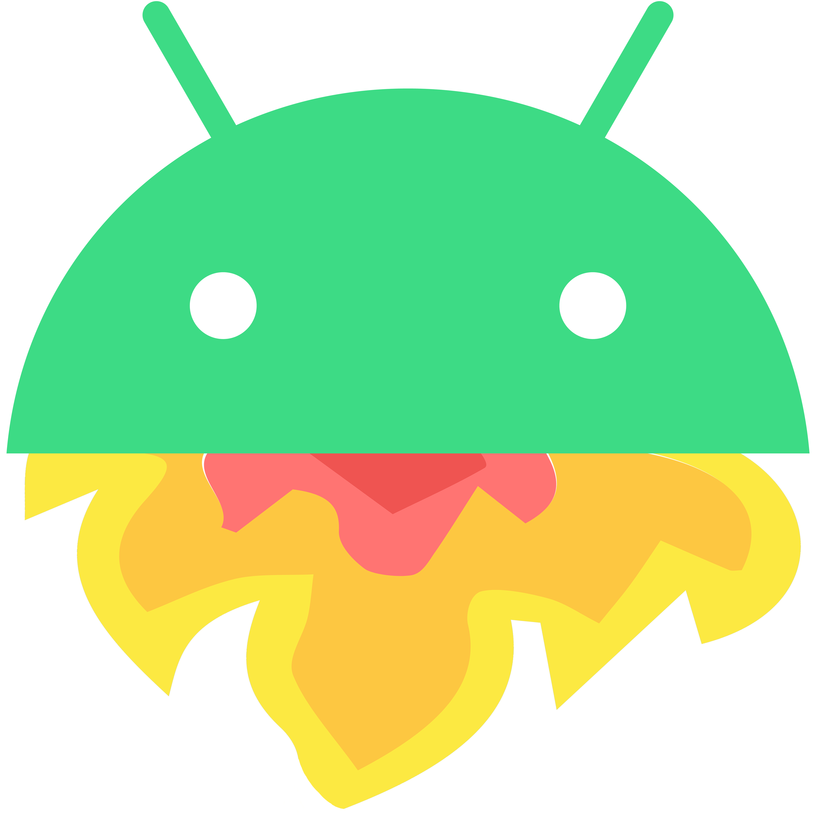
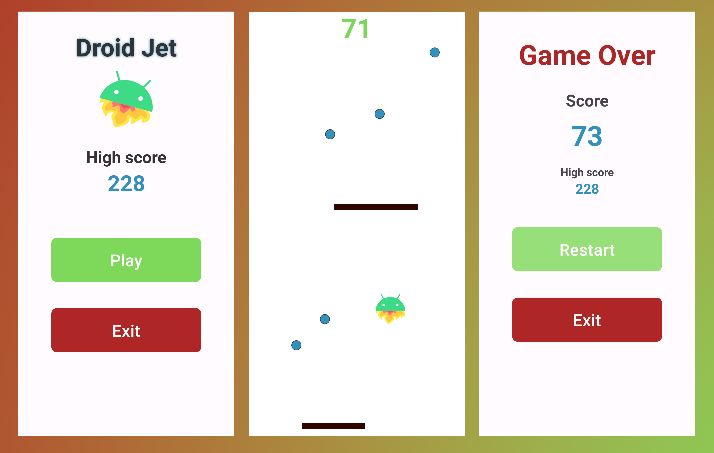

  

# Droid Jet - An Endless Android Game 📱🚀
Droid Jet is an exciting Android game where you pilot a spaceship through an endless space filled with barriers and rewards. Your objective is to survive as long as possible by skillfully navigating through the barriers and collecting rewards to increase your score. 🛸

## Features 🌟
- <b>Infinite Gameplay:</b> The game offers an endless experience, providing an ever-challenging environment where you can test your skills and beat your high score. ♾️

- <b>Intuitive Controls:</b> Use touch controls to move the spaceship smoothly across the screen, avoiding barriers and collecting rewards. 🕹️

- <b>Dynamic Scoring:</b> Collect rewards to increase your score by 5 points and skillfully cross barriers to earn 2 points. Challenge yourself to beat your own high score. 🏆

- <b>High Score Storage:</b> Droid Jet stores your highest achieved score locally using shared preferences, ensuring you can always strive to surpass your personal best. 📈

## Technical Overview 🧠
Droid Jet is built with a strong focus on performance and responsiveness. It utilizes the power of threads and runnables to create smooth gameplay. The main components responsible for rendering and updating the game environment are:

`GameView`: The heart of the game, responsible for rendering the game elements on the screen and handling touch events for the spaceship movement. 💻

`GameFragment`: This fragment manages the main gameplay loop, keeping track of the game state and handling game over conditions. 🔄

`BarrierComponent`: Handles the creation and movement of barriers that the player must avoid. The barriers speed up as the game progresses, adding to the challenge. 🔒

`RewardComponent`: Manages the rewards that the player collects for extra points. The spawn rate of rewards increases as the player's score rises. 🎁

`ShipComponent`: Represents the spaceship that the player controls. It allows smooth movement within the screen boundaries. 🚀

## How to Play 🕹️
Launch the game and tap the "Play" button on the home screen to start the endless space journey.

Use touch controls to move the spaceship. Drag your finger on the screen to move the ship up, down, left, or right. 🚀👆👇👈👉

Avoid colliding with barriers, as this will end the game. Cross the barriers without touching them to earn points.

Collect rewards to increase your score. Each reward collected adds 5 points to your score. 🌟🎉

Survive as long as possible, collect rewards, and cross barriers to achieve the highest score.

If you crash into a barrier, you'll see the "Game Over" screen. You can choose to restart the game or exit. ❌

## Screenshots 📷

  

## Video Preview 📹

## Contributing 🤝
Feel free to contribute to this project by submitting issues, pull requests, or providing valuable feedback. Your contributions are always welcome! 🙌

## License 📄
Droid Jet is released under the [MIT License](https://opensource.org/licenses/MIT). Feel free to modify or add to this list based on the specific features of your app. 📝

## Happy coding! 🎉👩‍💻👨‍💻
